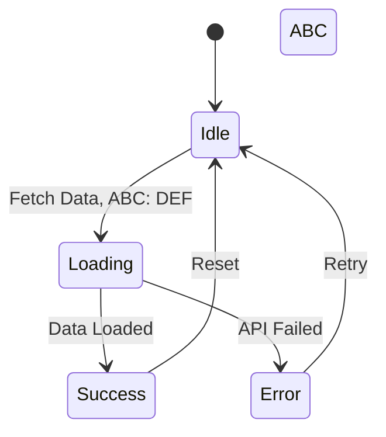
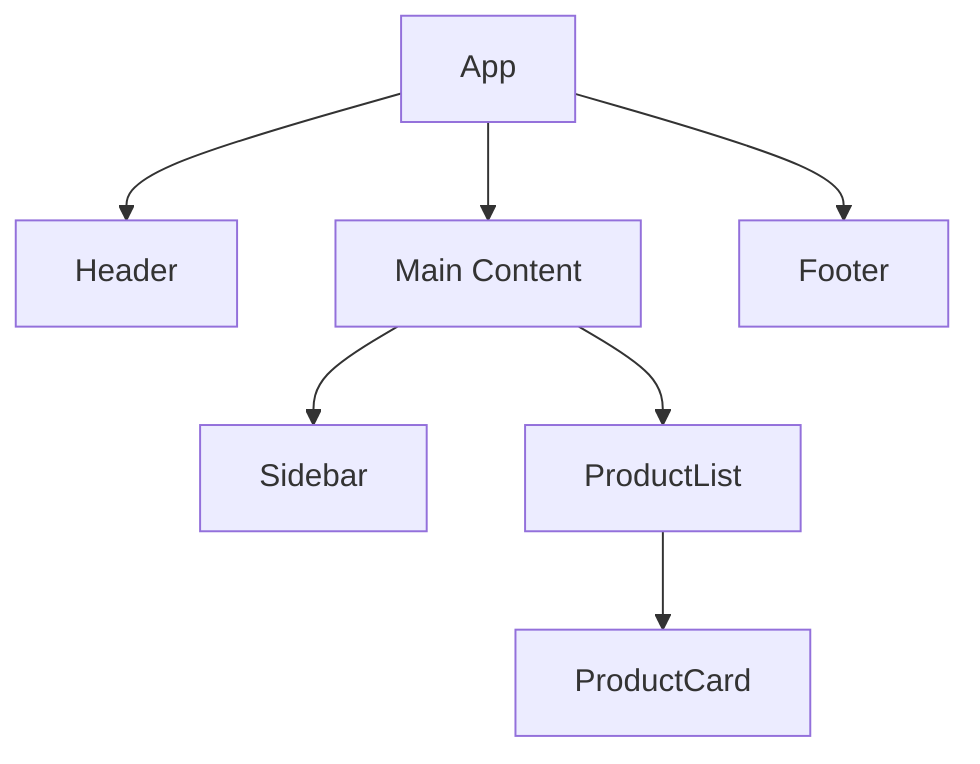

State Diagram

```mermaid
stateDiagram-v2
    [*] --> Idle
    Idle --> Loading: Fetch Data, ABC: DEF
    Loading --> Success: Data Loaded
    Loading --> Error: API Failed
    Success --> Idle: Reset
    Error --> Idle: Retry
    ABC
```

Component Hierarchy Diagram

```mermaid
graph TD
    App --> Header
    App --> Main[Main Content]
    App --> Footer
    Main --> Sidebar
    Main --> ProductList
    ProductList --> ProductCard
```